# MMGIS Landing Page Mockups

12 landing page design concepts. Each preserves the MMGIS logo in the top-left (matching the loading screen position for a seamless blend effect) and makes it clear this is a mapping application.

---

## LP-01: Hero Map Preview
Full-screen map background with grid overlay, glassmorphism mission cards, and a prominent search bar.

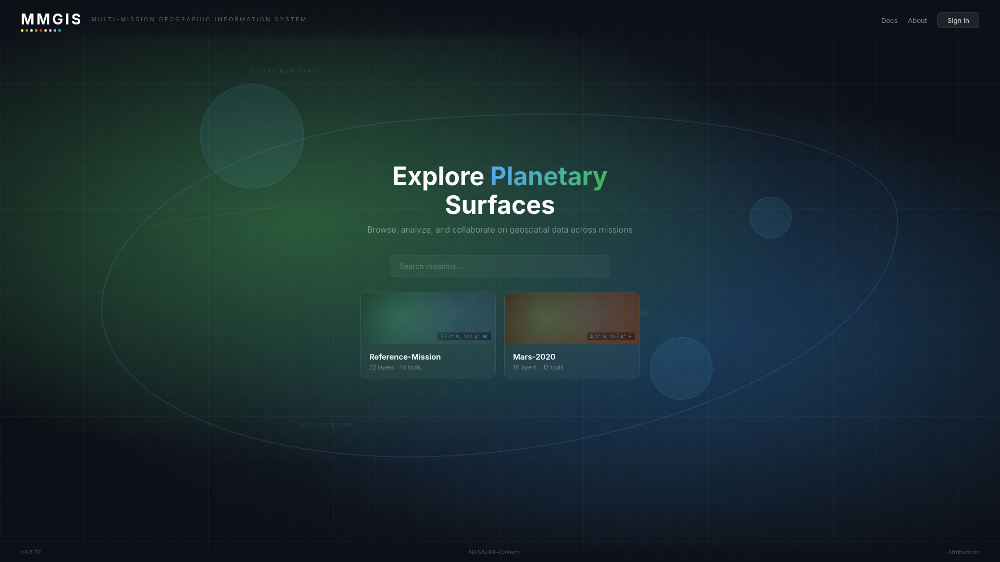

---

## LP-02: Split Globe
Left panel with mission list, right panel with an animated globe and orbital rings. Strong planetary/GIS identity.

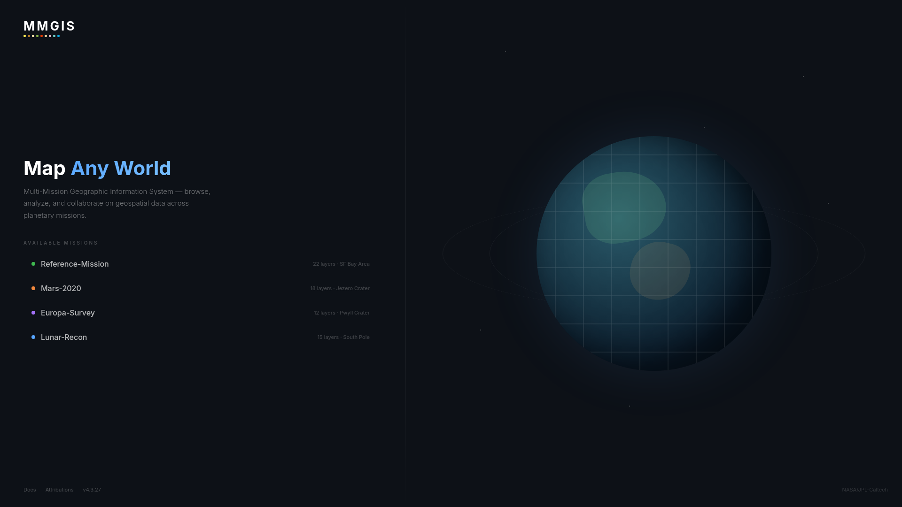

---

## LP-03: Minimal Dark
Ultra-minimal centered mission list. Subtle gradient, hover-arrow animations. Maximum focus on content.

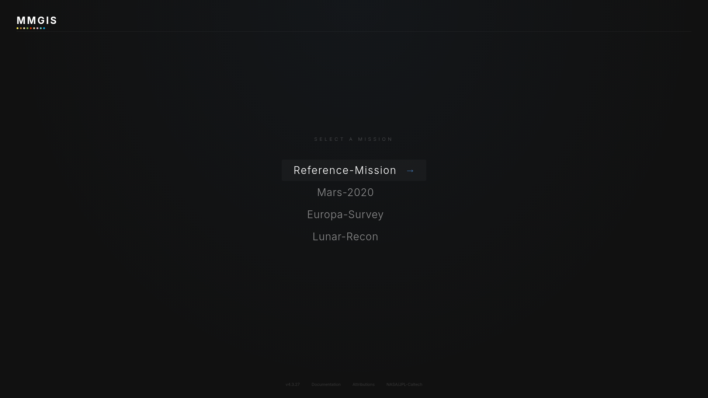

---

## LP-04: Light Modern Cards
Light theme with top nav bar, search, and mission cards in a 3-column grid. Clean, approachable feel.

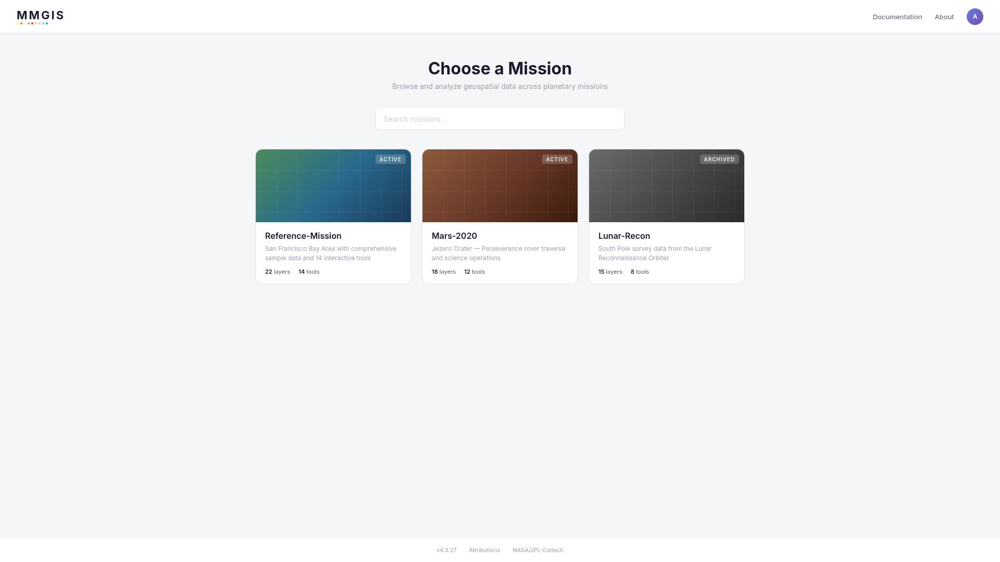

---

## LP-05: Full-Bleed Satellite
Satellite/terrain imagery background with floating pill-style mission selector. Coordinate display in corner.

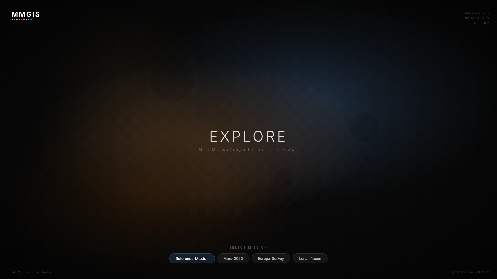

---

## LP-06: Command Center
Three-column mission control layout — missions panel, map preview with crosshairs, status/activity panel. Monospace accents.

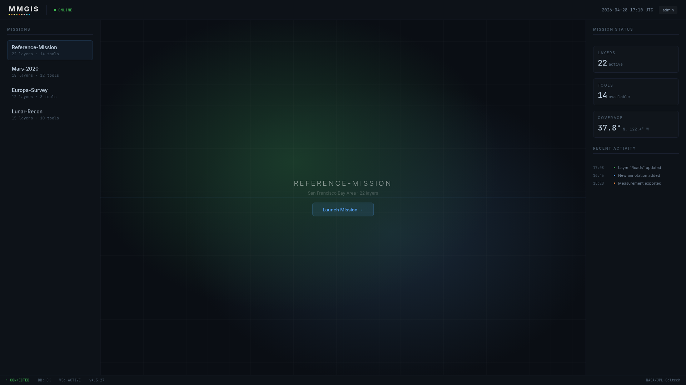

---

## LP-07: Cinematic Widescreen
Letterboxed layout with nebula background. Large centered MMGIS title with mission names below.

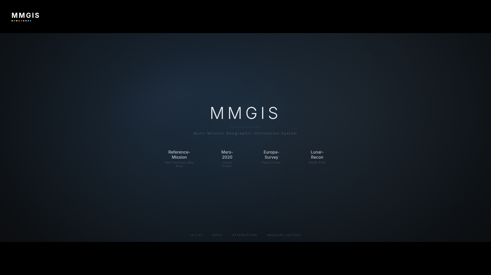

---

## LP-08: Atlas / Cartography
Parchment-textured light theme with serif typography, compass rose, and grid lines. Old-world atlas aesthetic.

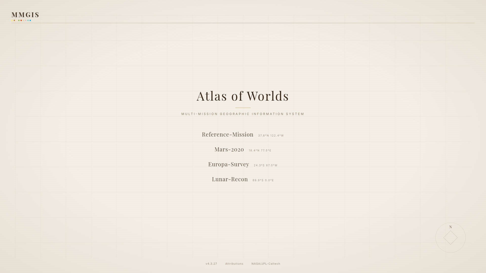

---

## LP-09: Search-First
Google-style search-centric layout. Large logo, prominent search bar, quick-access mission pills, recent history.

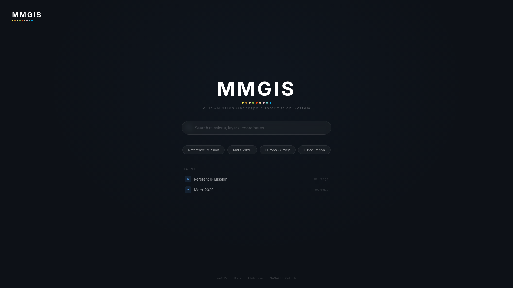

---

## LP-10: Right Sidebar with Map Preview
Map preview fills the left, mission list in a right sidebar. Hover a mission to update the map preview.

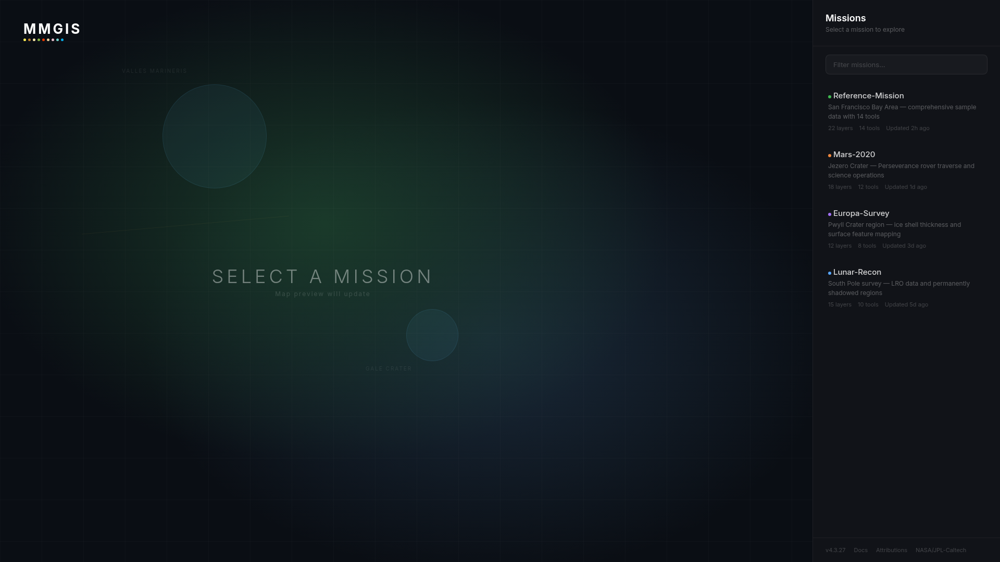

---

## LP-11: Warm Earth Tones
Warm brown/amber palette with topographic contour lines. Mission cards with emoji planet icons.

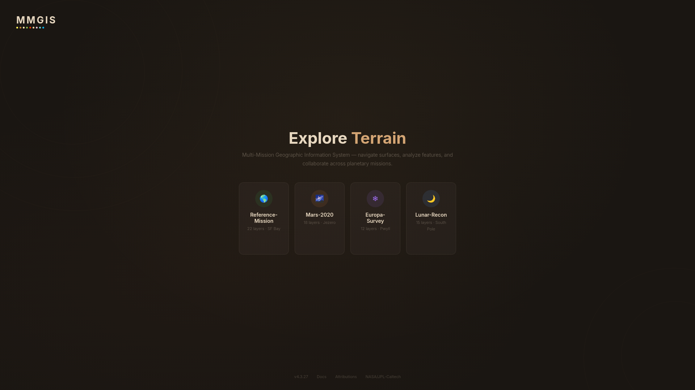

---

## LP-12: Glass Dashboard
Dashboard grid with glassmorphism panels — missions, map preview, statistics, and activity log.

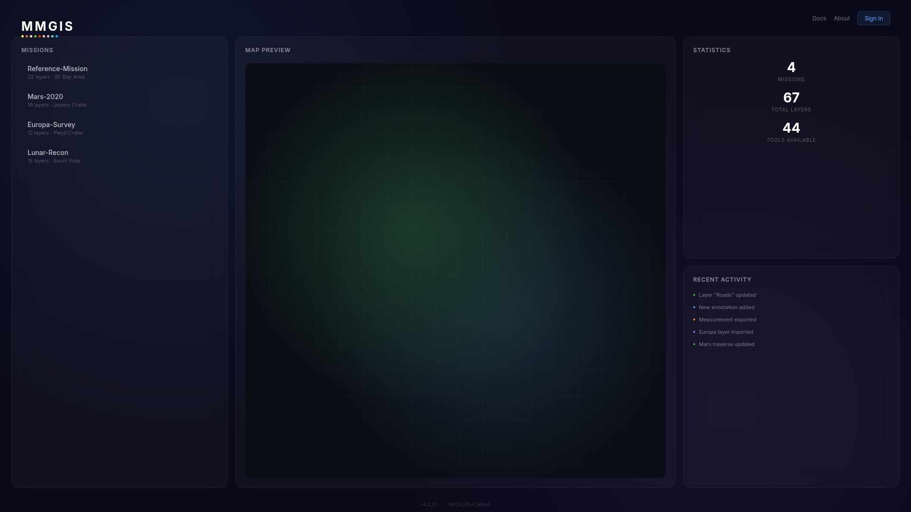

---

*All mockup source HTML files are in `ui-screenshots/mockups/lp-*.html`.*
