# MMGIS Logo Concepts

## Original Designs

### Icon Marks
    

### Wordmarks
 

### Combined Logos
  

---

## New Concepts

### Navigation & Compass
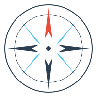 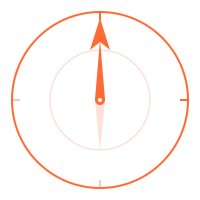 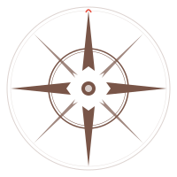 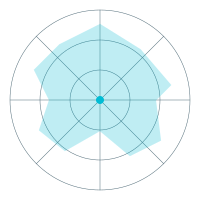 

### Space & Planetary
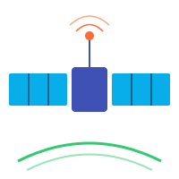   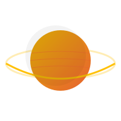 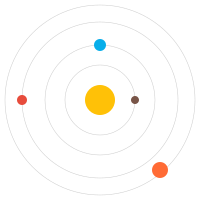 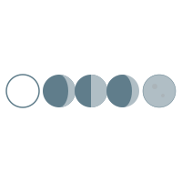 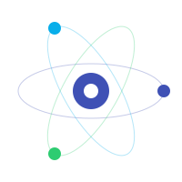 

### Grids & Geometry
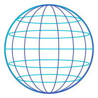 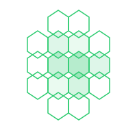 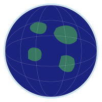  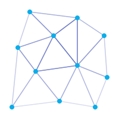 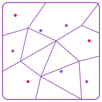  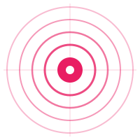

### Data Visualization
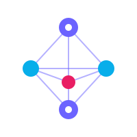 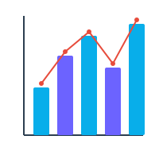 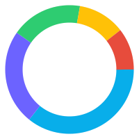 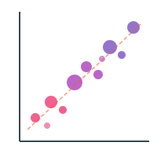 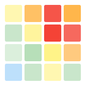 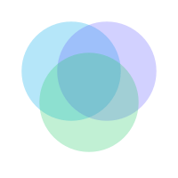

### Terrain & Geography
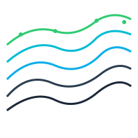  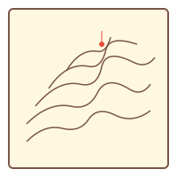 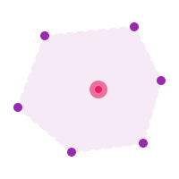 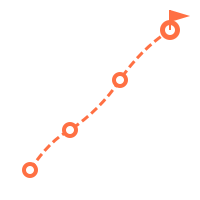 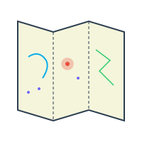 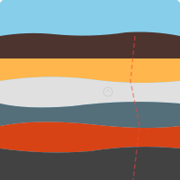 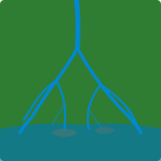 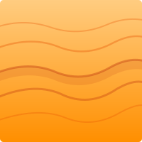  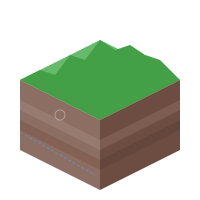

### Science & Technology
 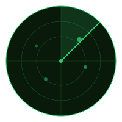  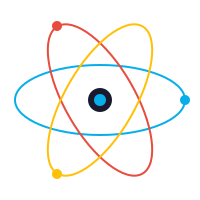  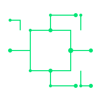  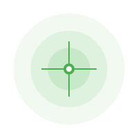 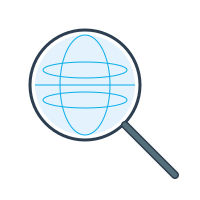

### Symbols & Abstract
   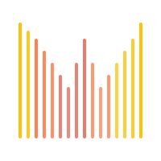 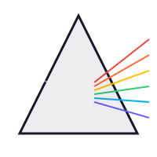 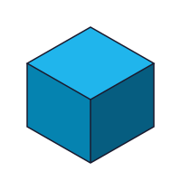   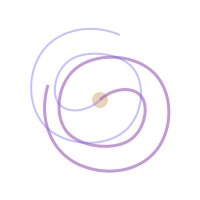 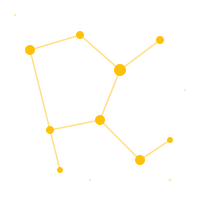 

---

## Creative & Artistic

### Cosmic Phenomena
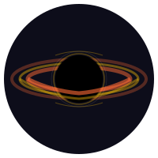 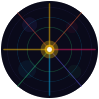 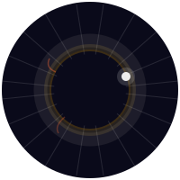 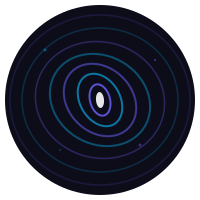 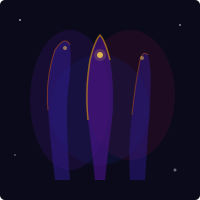 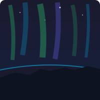  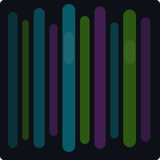 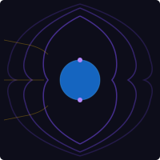

### Geological Art
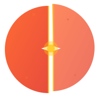 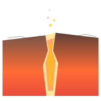       

### Impossible & Abstract Geometry
      

### Nature & Organic
     

### Artistic Scenes
        

### Data as Art
      
