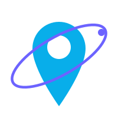
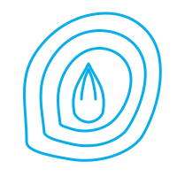
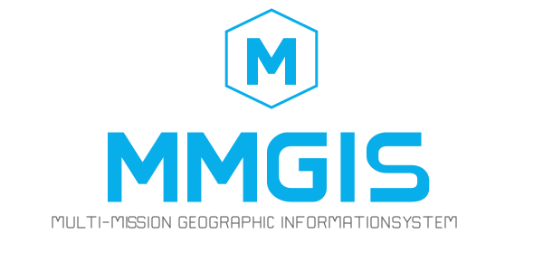

# MMGIS Logo Concepts

## Icon Marks

### 1. Globe Grid

### 2. Stacked Layers

### 3. Hexagon M

### 4. Orbit Pin

### 5. Topographic

## Wordmarks

### 6. Geometric Wordmark

### 7. Tech Wordmark

## Combined Logos

### 8. Globe + Wordmark

### 9. Layers + Wordmark

### 10. Stacked

