# LayersTool redesign — mockups

Visual exploration only. **Nothing here is implemented** — this directory contains rendered
images and this document. No file outside `/mockup` is touched by this branch.

Two things are held fixed in every image:

1. The LayersTool as a React component tree instead of jQuery + string-built HTML.
2. **Layer types own their settings UI.** The tool reads whatever a type registers and renders
   it; it never branches on the type id.

Everything else is a variable. Images **01–05** work out the asked-for direction in full —
settings filling the whole tool panel with a back `←` at the top right. Images **06–16** are
eleven alternative directions for the same two invariants: different answers to *where settings
live*, *what the list is for*, and *what each one asks the layer-type contract for*. Image **17**
puts all twelve side by side.

**Chosen direction → [`LayersNew-devin-prompt.md`](./LayersNew-devin-prompt.md)**: the
implementation prompt for a new core tool `LayersNew`, taking 06's full-height slide-over drawer
as the settings presentation, 02's tabbed settings content inside it, 11's raster thumbnails and
an enhanced (not search-first) list search. It
carries the `settings` registry-surface contract and a complete parity matrix of the current
tool's behavior.

Everything is drawn in MMGIS's existing dark theme tokens (`src/design-system/themes.js`,
`--color-a*`, `--color-<type>`) and composed from components that already exist in
`src/design-system/components/` — the few genuinely new shared pieces are called out per image
and summarised at the bottom.

---

## Today, for reference

Captured from a running Reference Mission on `development`, so the comparison is against the
real thing rather than from memory.

| Layer list | Vector settings | Raster settings |
| --- | --- | --- |
| 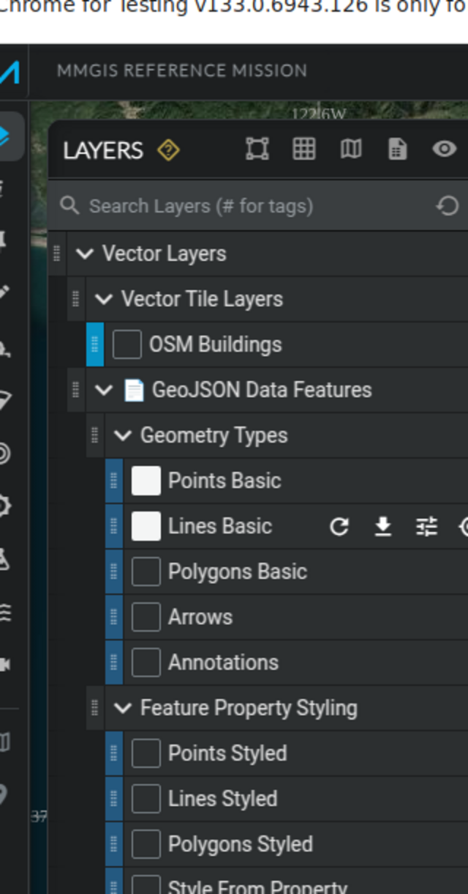 | 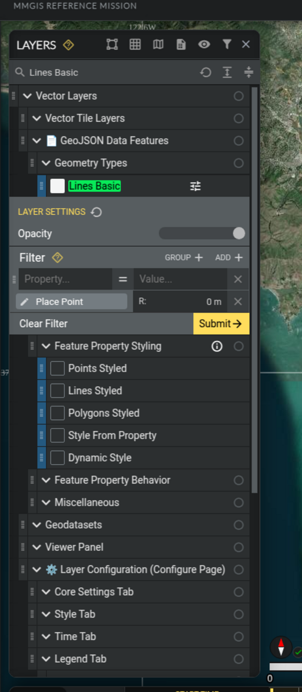 | 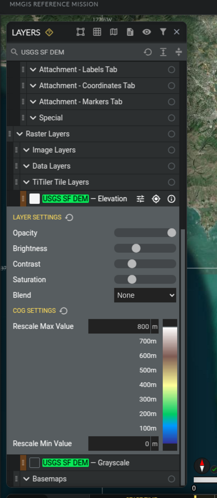 |

The two things the redesign reacts to are visible here: a layer's settings open *inside* the
tree and push everything below them down, and every control lives in a ~300px column — which is
why the dynamic-style editor, the filter builder and the COG rescale + colormap have all ended
up as very tall, very narrow stacks. `plugins/core/tools/Layers/LayersTool.js` is ~3,875 lines
and carries all of that type-specific markup itself.

---

## 01 · Layer list (root view)

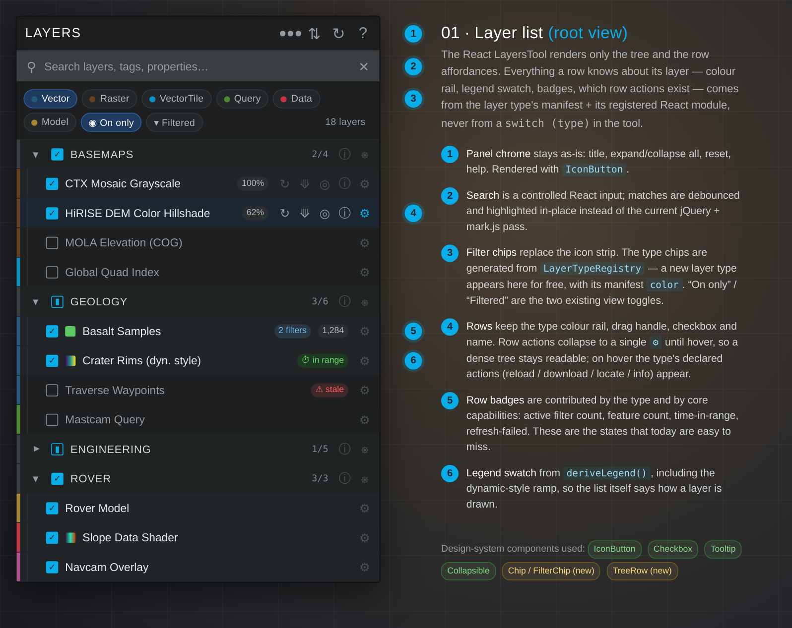

The list keeps what works today — type colour rails, group counts, drag handles, the search
row — and changes what a row *says*:

- Row actions collapse to a single gear until hover, so a dense tree stays readable. Which
  actions a row has comes from the type's capabilities, not from a hardcoded set.
- Badges surface state that is currently invisible or buried: active filter count, feature
  count, time-in-range, refresh failure.
- The legend swatch is the type's own `legend.derive()` output, including the dynamic-style
  ramp, so the list itself shows how a layer is drawn.
- The icon strip becomes filter chips generated from the registered layer types — a new type,
  including one from an external plugin, appears there for free with its manifest `color`.

## 02 · Layer settings — vector

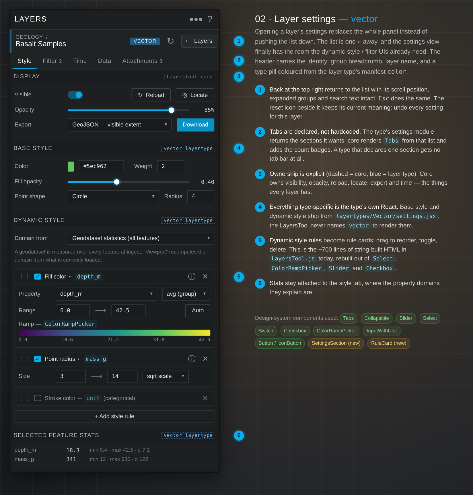

Opening settings replaces the whole panel. Back at the top right (and `Esc`) returns to the
list with scroll position, expanded groups and search text intact.

- The header carries identity: group breadcrumb, layer name, a type pill coloured from the
  manifest, and the existing reset action.
- Tabs are **declared by the type**, not hardcoded. The vector module asks for
  Style / Filter / Time / Data / Attachments; a type that declares one section gets no tab bar.
- Each section is labelled with its owner — dashed = LayersTool core, blue = layer type. Core
  keeps only what every layer has: visibility, opacity, reload, locate, export, time.
- Dynamic style rules become rule cards (reorder, toggle, delete) with room for property,
  statistic, domain and ramp. That is the ~700 lines of string-built HTML in `LayersTool.js`
  today, rebuilt from `Select`, `Slider`, `Checkbox` and `ColorRampPicker`.

## 03 · Layer settings — tile / raster

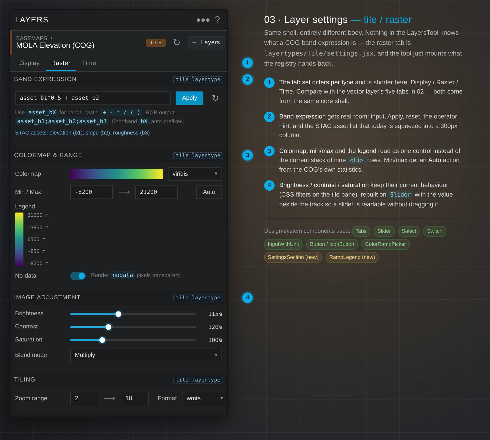

Same shell, entirely different body, and the tool knows nothing about either. The band
expression gets real room (input, apply, reset, operator hint, STAC asset list); colormap,
min/max and the legend read as one control instead of nine stacked rows; brightness / contrast /
saturation keep their current CSS-filter behaviour with the value beside the track.

## 04 · The same shell, three more layer types

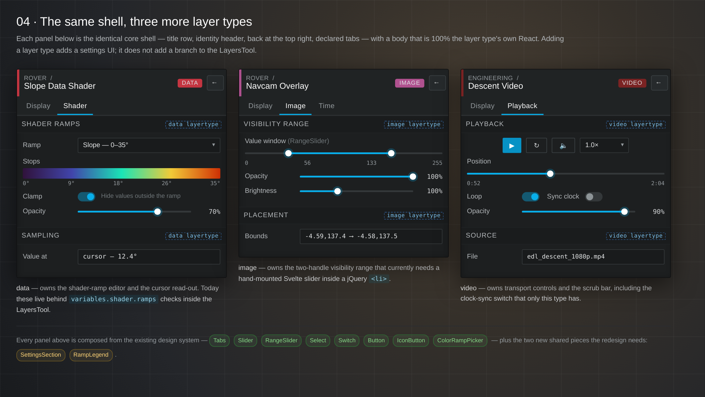

`data` owns its shader-ramp editor, `image` its two-handle visibility range, `video` its
transport and scrub bar including the clock-sync switch only it has. Adding a layer type adds a
settings UI; it does not add a branch to the LayersTool.

## 05 · How a layer type owns its settings UI

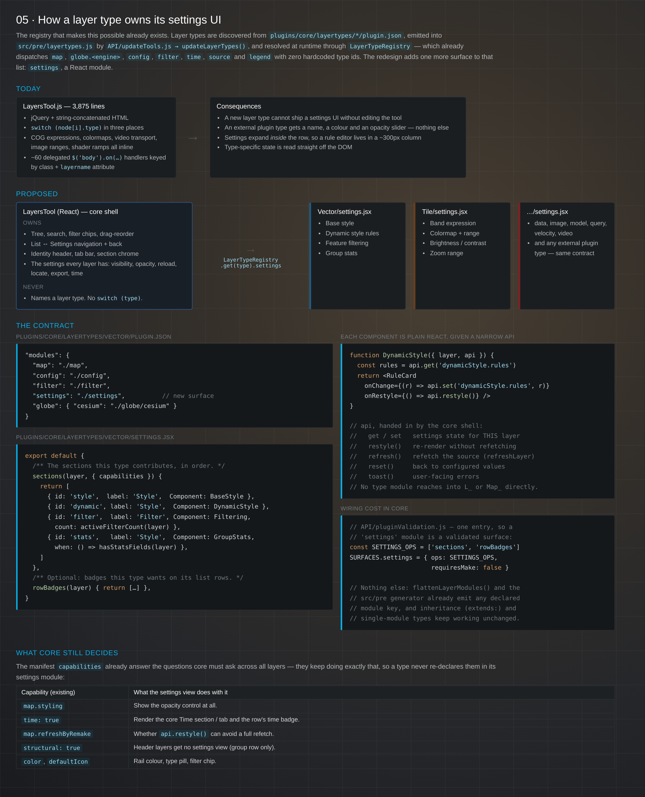

The mechanism already exists. Layer types are discovered from
`plugins/core/layertypes/*/plugin.json`, emitted into `src/pre/layertypes.js` by
`API/updateTools.js → updateLayerTypes()`, and resolved through `LayerTypeRegistry`, which
already dispatches `map`, `globe.<engine>`, `config`, `filter`, `time`, `source` and `legend`
with no hardcoded type ids. The proposal adds one more surface to that list — `settings`, a
React module:

```jsonc
// plugins/core/layertypes/Vector/plugin.json
"modules": {
  "map": "./map",
  "config": "./config",
  "settings": "./settings"   // new surface
}
```

```jsx
// plugins/core/layertypes/Vector/settings.jsx
export default {
    // The sections this type contributes, in order.
    sections(layer, { capabilities }) {
        return [
            { id: 'style', label: 'Style', Component: BaseStyle },
            { id: 'dynamic', label: 'Style', Component: DynamicStyle },
            { id: 'filter', label: 'Filter', Component: Filtering,
              count: activeFilterCount(layer) },
        ]
    },
    // Optional: badges this type wants on its list rows.
    rowBadges(layer) { … },
}
```

Each `Component` is plain React, handed a narrow `api` (`get` / `set` settings state for this
layer, `restyle()`, `refresh()`, `reset()`, `toast()`) so no type module reaches into `L_` or
`Map_` directly.

Wiring cost in core is one entry, so `settings` is a validated surface like the others:

```js
// API/pluginValidation.js
const SETTINGS_OPS = ['sections', 'rowBadges']
SURFACES.settings = { ops: SETTINGS_OPS, requiresMake: false }
```

Nothing else: `flattenLayerModules()` and the `src/pre` generator already emit any declared
module key, and `extends:` inheritance and single-`module` layer types keep working unchanged.

Core still decides everything that must be asked of *every* layer, from the manifest
capabilities that already exist: `map.styling` gates the opacity control, `time: true` gates the
time section and the row's time badge, `map.refreshByRemake` decides whether `api.restyle()` can
avoid a refetch, `structural: true` means no settings view at all, and `color` / `defaultIcon`
drive the rail, the type pill and the filter chip.

---

# Eleven other directions

Each of these is a different bet, not a restyle of 02. They are numbered, not ranked; the
comparison table in [17](#17--all-twelve-side-by-side) is the honest summary, including which
ones are cheap and which two are not.

## 06 · Settings as a slide-over drawer

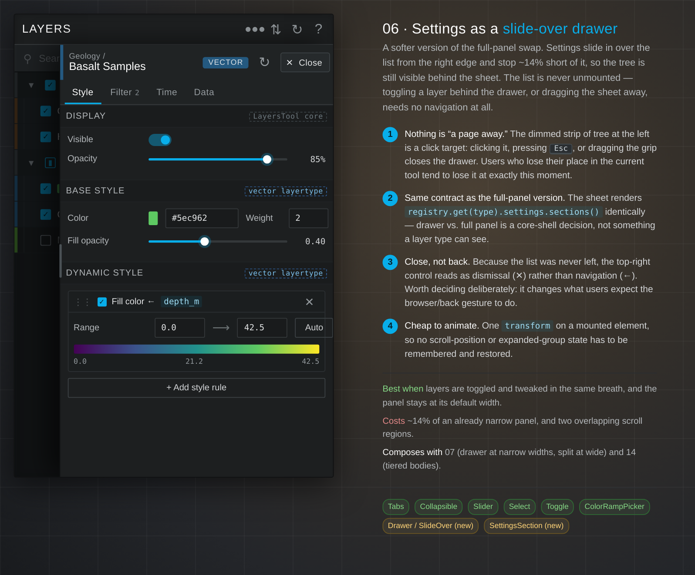

Settings slide in over the list from the right edge and stop short of it, so the tree stays
visible and mounted behind the sheet. Nothing is "a page away": clicking the strip of tree,
`Esc`, or dragging the grip dismisses it, and toggling a layer behind the drawer needs no
navigation at all. Same `sections()` contract as 02 — drawer vs. full panel is a core-shell
decision a layer type can't see. Costs ~14% of an already narrow panel and two overlapping
scroll regions.

## 07 · Split master–detail

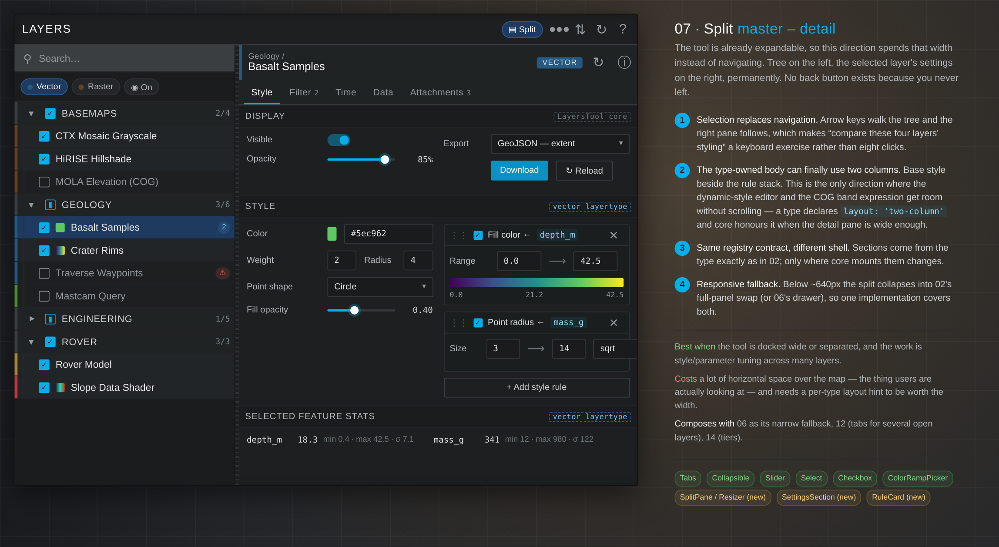

The tool is already expandable, so this spends that width instead of navigating: tree left,
selected layer's settings right, permanently. There is no back button because you never left, and
arrow keys walking the tree make "compare these four layers' styling" a keyboard exercise. It is
the only direction where a type body gets two columns — base style beside the rule stack — which
needs one addition to the contract: a `layout: 'two-column'` hint core honours when the detail
pane is wide. Costs a lot of horizontal space over the map, and needs 02 or 06 as its narrow
fallback.

## 08 · Floating settings windows

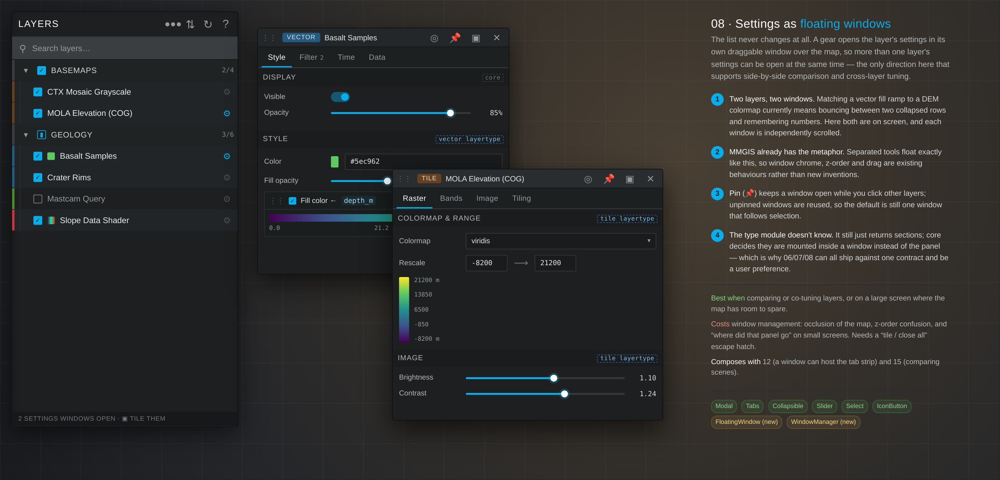

The list never changes at all; a gear opens the layer's settings in its own draggable window over
the map. The only direction that supports genuine side-by-side tuning — matching a vector fill
ramp to a DEM colormap without remembering numbers. MMGIS already has the metaphor in separated
tools, so window chrome, z-order and drag are existing behaviours. Costs window management:
occlusion, z-order confusion, and "where did that panel go" on small screens.

## 09 · Least change: inline essentials + escape hatch

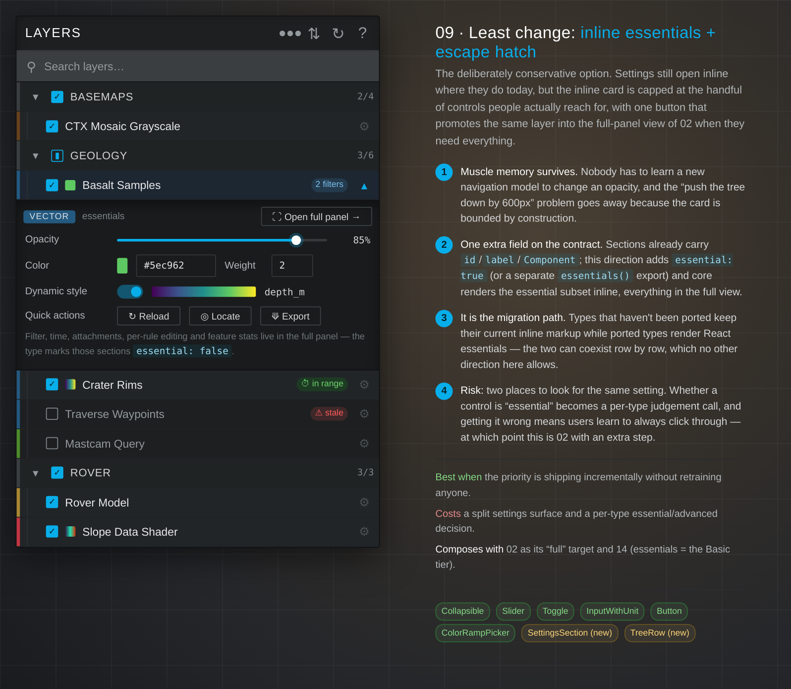

The deliberately conservative option. Settings still open inline where they do today, but the
card is capped at the controls people actually reach for, with one button that promotes the same
layer into 02's full-panel view. Muscle memory survives and the "push the tree down by 600px"
problem goes away because the card is bounded by construction. It is also the migration path:
unported types keep their current markup while ported types render React essentials, row by row.
Costs a split settings surface and a per-type `essential: true` judgement call.

## 10 · Search-first, keyboard driven

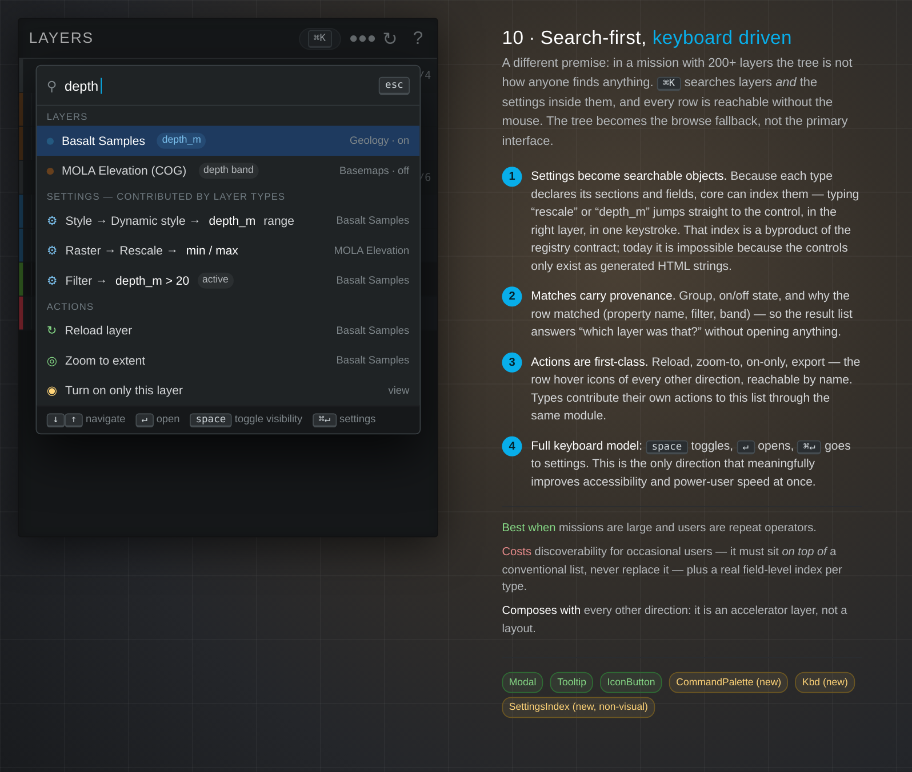

A different premise: in a 200-layer mission the tree is not how anyone finds anything. `⌘K`
searches layers *and the settings inside them* — typing "rescale" or a property name jumps
straight to that control in the right layer. That index is a byproduct of the registry contract
(each type declares its sections and fields) and is impossible today, when controls exist only as
generated HTML strings. It is an accelerator layer, not a layout: it must sit on top of a
conventional list, never replace it.

## 11 · The compositor stack

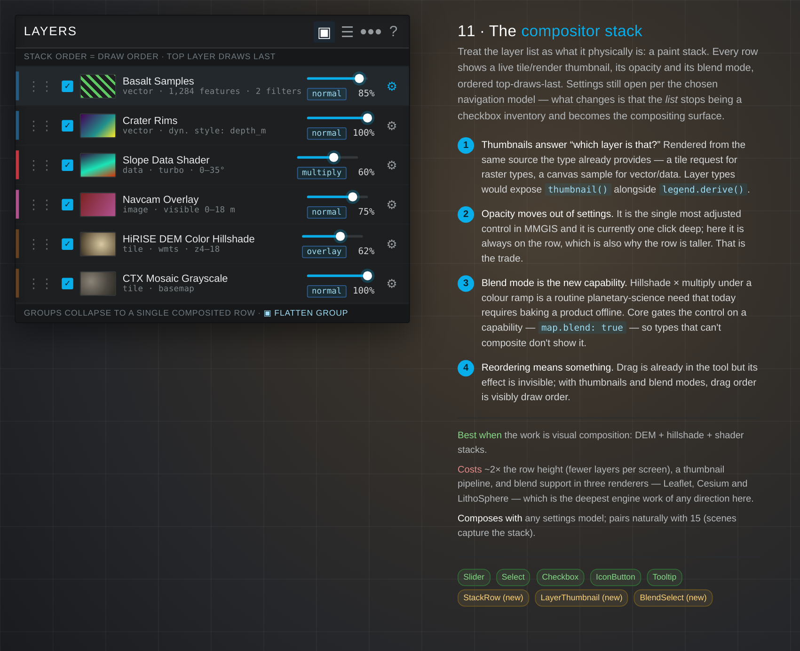

Treat the list as what it physically is — a paint stack. Every row carries a render thumbnail,
opacity and a blend mode, ordered top-draws-last, so drag order is visibly draw order. Opacity
moves out of settings entirely, and hillshade × multiply under a colour ramp stops being an
offline product. The deepest engine work of any direction here: a thumbnail pipeline plus blend
support in Leaflet *and* Cesium *and* LithoSphere, at ~2× the row height.

## 12 · Open settings as a tab strip

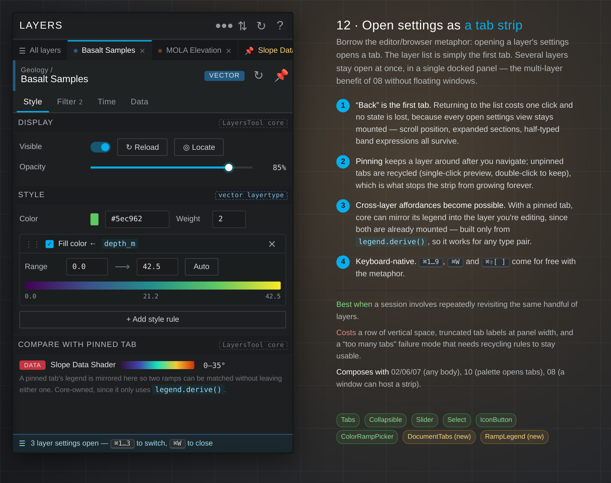

Borrow the editor metaphor: opening a layer's settings opens a tab, and the layer list is simply
the first tab. Several layers stay open in one docked panel — 08's multi-layer benefit without
floating windows — and returning to the list costs one click with zero state loss, because every
open view stays mounted. Pinning keeps a layer around while unpinned tabs are recycled, which is
what stops the strip from growing forever. Costs a row of vertical space and truncated labels at
panel width.

## 13 · Card workbench

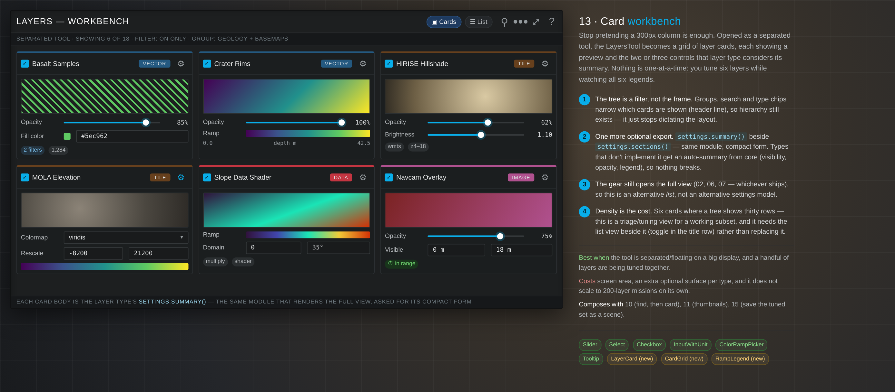

Stop pretending a 300px column is enough. Opened as a separated tool, the tool becomes a grid of
layer cards, each showing a preview and the two or three controls its type considers its
summary — so nothing is one-at-a-time and six legends are visible at once. That is one optional
addition, `settings.summary()`, with a core-generated fallback for types that don't implement it.
Costs density: it is a triage view for a working subset and needs the list beside it, not
instead of it.

## 14 · Tiered settings: Basic / Advanced / JSON

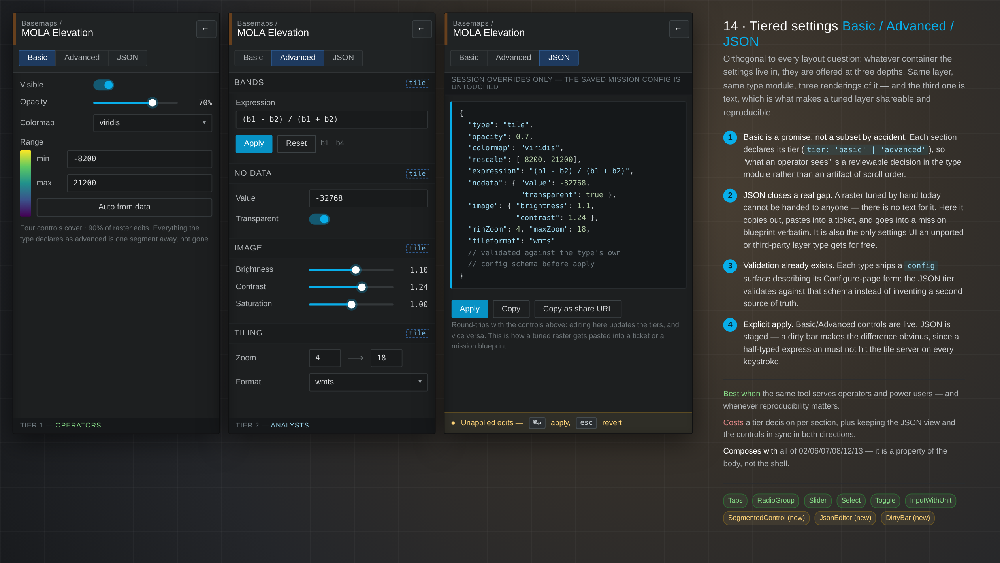

Orthogonal to every layout question — the same body offered at three depths. Basic is a promise
rather than an accident of scroll order, because each section declares its own `tier`. The JSON
tier closes a real gap: a raster tuned by hand today cannot be handed to anyone, and here it
copies out, pastes into a ticket and goes into a mission blueprint verbatim. It is also the only
settings UI an unported or third-party type gets for free, and it validates against the `config`
schema each type already ships.

## 15 · Scenes & state you can name

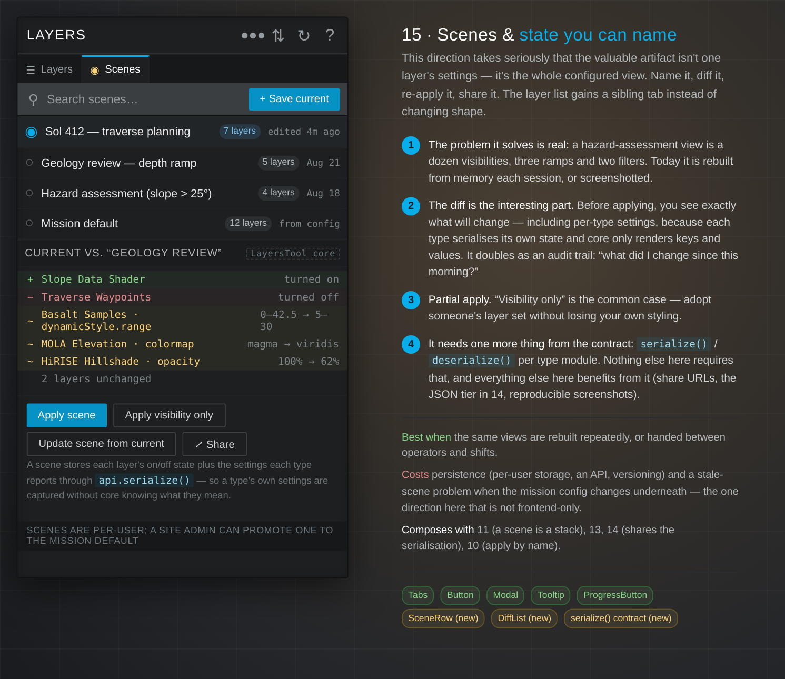

Takes seriously that the valuable artifact isn't one layer's settings — it's the whole configured
view. Name it, diff it, re-apply it, share it. The diff is the interesting part: before applying
you see exactly what changes, per-type settings included, because each type serialises its own
state and core only renders keys and values. Needs one more contract method
(`serialize()` / `deserialize()`), and it is the one direction that is not frontend-only —
storage, an API, versioning, and a stale-scene problem when the mission config changes underneath.

## 16 · Compact / touch

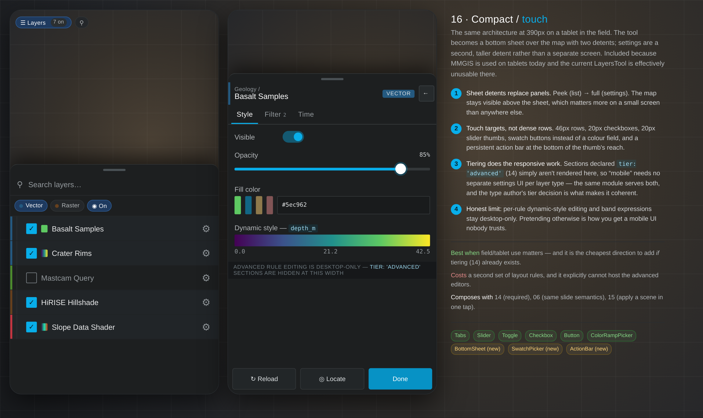

The same architecture at 390px on a tablet in the field, where the current tool is effectively
unusable. The tool becomes a bottom sheet over the map with two detents — list, then settings —
so the map stays visible, with 46px rows and thumb-reach actions. Tiering (14) does the
responsive work: sections declared `tier: 'advanced'` simply aren't rendered here, so "mobile"
needs no separate settings UI per layer type. Honest limit: per-rule dynamic style and band
expressions stay desktop-only.

## 17 · All twelve, side by side

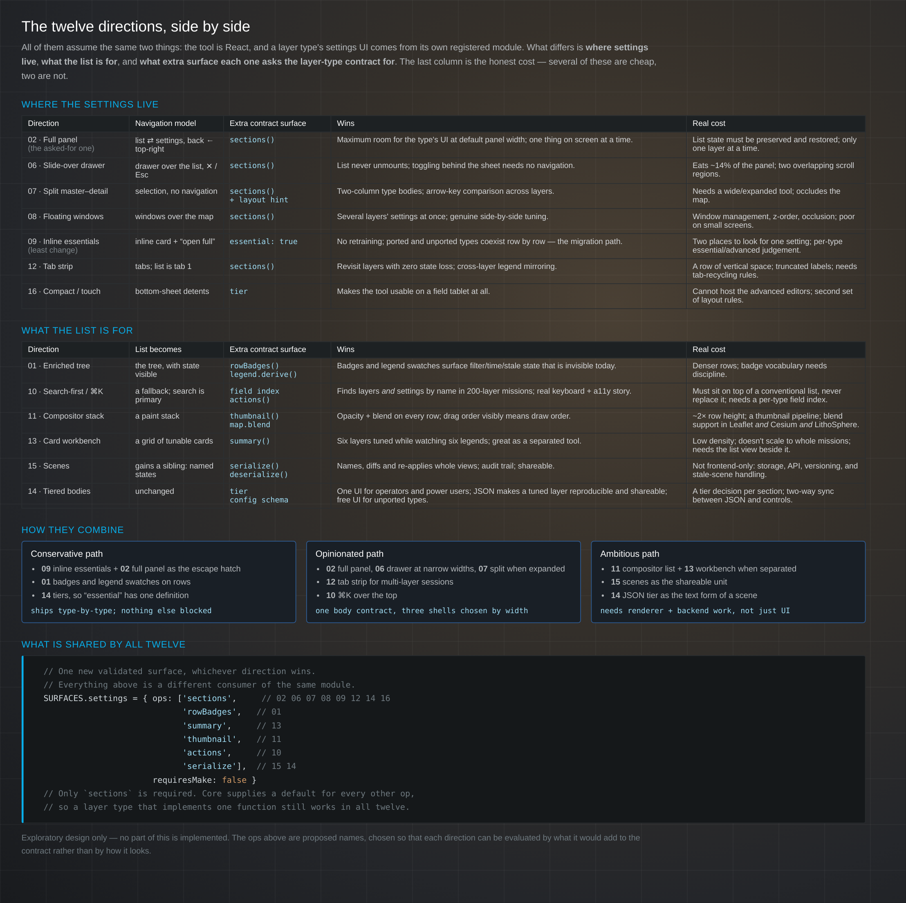

Grouped by what they actually change — where the settings live vs. what the list is for — with
the extra contract surface and the real cost of each, three suggested combinations
(conservative / opinionated / ambitious), and the single validated surface all twelve share.

The useful conclusion from the table: only `sections()` is required. Every other op above
(`rowBadges`, `summary`, `thumbnail`, `actions`, `serialize`) is optional with a core-supplied
default, so a layer type that implements one function still works in all twelve directions — and
several of these can ship on top of each other rather than instead of each other.

---

## Design-system usage

Already in `src/design-system/components/`, used as-is: `Tabs`, `Collapsible`, `Slider`,
`RangeSlider`, `Select`, `Dropdown`, `Toggle`, `Checkbox`, `RadioGroup`, `ColorRampPicker`,
`InputWithUnit`, `Button`, `IconButton`, `IconTextButton`, `Tooltip`, `Modal`.

Proposed additions, each because the mockups need it more than once and none of the above covers
it:

| New component | Why | Built from |
| --- | --- | --- |
| `SettingsSection` | Every settings body is a titled section with an owner label; types shouldn't each re-style a header. | `Collapsible` |
| `RuleCard` | Reorderable, toggleable, deletable card with a header and a body — dynamic style rules, filter groups, shader ramps. | `Checkbox`, `IconButton` |
| `RampLegend` | Horizontal and vertical colour ramp with tick labels, shared by dynamic style, COG colormap and data shaders. | `ColorRampPicker` ramp data |
| `FilterChip` | Toggleable chip with a type dot, for the type filter row. | `Button` |
| `TreeRow` | The list row itself: rail, indent, checkbox, swatch, name, badges, hover actions. | `Checkbox`, `IconButton`, `Tooltip` |

The alternative directions each add shell components rather than new controls — they are listed
on their images and collected here so the cost is visible: `Drawer / SlideOver` (06),
`SplitPane / Resizer` (07), `FloatingWindow` + `WindowManager` (08), `CommandPalette` + `Kbd`
(10), `StackRow` + `LayerThumbnail` + `BlendSelect` (11), `DocumentTabs` (12), `LayerCard` +
`CardGrid` (13), `SegmentedControl` + `JsonEditor` + `DirtyBar` (14), `SceneRow` + `DiffList`
(15), `BottomSheet` + `SwatchPicker` + `ActionBar` (16). Only 08, 11 and 16 need components that
don't reduce to existing primitives.

## Open questions

- ~~**Should a layer's configured definition (Configure page) appear in the tool?**~~
  **Resolved: no.** The tool is about session state, which is what it does today; a `Config` /
  raw-JSON tab is out of scope. The only configured values shown remain the ones that exist to
  make "reset" meaningful (COG rescale, COG expression, velocity range).
- **Migration order.** The shell (list + navigation + core sections) can land before any type
  ships a `settings` module, as long as core falls back to today's markup for types that don't;
  or the vector type goes first as the proof and the rest follow.
- **Panel width.** The full-panel settings view assumes the tool's current expandable width. A
  rule editor is comfortable at ~420px but the STAC/band-expression body would prefer more.
- **Which shell, and is it a preference?** 02, 06, 07 and 12 differ only in where core mounts the
  same body, so they can coexist as a user preference — worth deciding deliberately, because
  "all of them" is four layouts to maintain and four sets of state-restoration bugs.
- **Optional ops or required ones?** If `summary()` (13) and `thumbnail()` (11) stay optional
  with core fallbacks, third-party types keep working but the workbench and compositor are
  uneven; if they are required, every type author pays for a direction they may not use.
- **Attachments.** `LayerAttachmentRegistry` has the same shape as the type registry, so
  attachments could contribute sections to the same view — the vector mockup shows an
  `Attachments 3` tab as a placeholder for that, not a designed screen.
